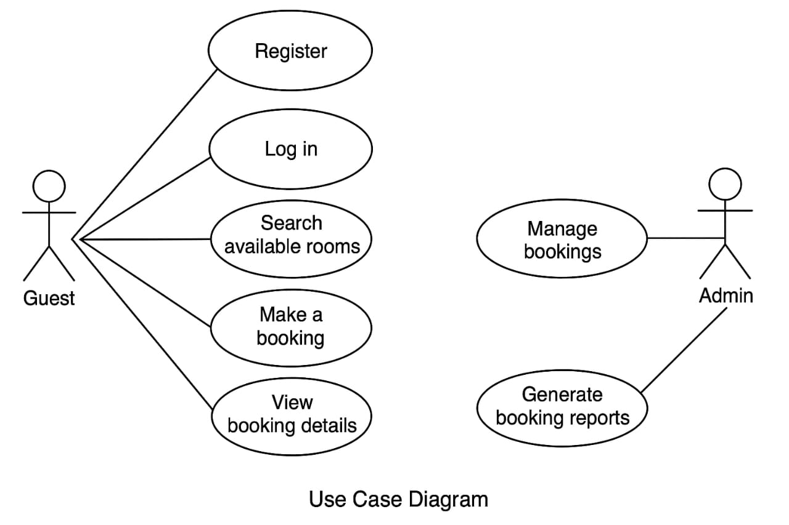

# Requirement Analysis in Software Development

## 📘 Introduction

Welcome to the **Requirement Analysis Project** for a **Booking Management System**.

This repository is designed to simulate a real-world software development scenario by focusing on the crucial **Requirement Analysis** phase of the Software Development Life Cycle (SDLC). The goal is to practice and master the techniques used in gathering, analyzing, documenting, and visualizing requirements to create a strong foundation for successful project execution.

Through a series of structured tasks, this project will guide learners through identifying functional and non-functional requirements, building use case diagrams using tools like Draw.io, defining acceptance criteria, and producing high-quality documentation that aligns with industry standards.

This project is ideal for developers, analysts, or students who want hands-on experience in transforming ideas into clear, actionable requirements that support scalable and effective software solutions.

Stay tuned as each section of this repository will evolve with more documentation, diagrams, and learning insights as we progress through the project steps.

## 📌 What is Requirement Analysis?

**Requirement Analysis** is the process of identifying, documenting, and managing the needs and expectations of stakeholders for a software system. It is a critical phase in the **Software Development Life Cycle (SDLC)**, acting as the bridge between business goals and technical solutions. The goal of requirement analysis is to ensure that the development team clearly understands what the system should do, how it should behave, and any constraints it must operate under.

During this phase, stakeholders—including clients, users, project managers, and developers—collaborate to gather information about system needs. These needs are then analyzed, prioritized, and documented in a structured format to guide the design, development, and testing processes.

### 💡 Importance in the SDLC:
- ✅ **Clarity of Objectives**: Ensures all stakeholders have a shared understanding of what the software will do.
- ✅ **Minimizes Rework**: Helps avoid costly changes and bugs by identifying issues early.
- ✅ **Improves Planning**: Supports better estimation of time, resources, and budget.
- ✅ **Enhances Quality**: Leads to the development of solutions that align with user expectations.
- ✅ **Foundation for Design**: Provides the baseline for designing architecture, user interfaces, and workflows.

Requirement analysis typically results in the classification of requirements into:
- **Functional Requirements** – What the system should do (features, tasks, interactions).
- **Non-Functional Requirements** – How the system should perform (security, scalability, usability, etc.).

It may also include tools such as **use case diagrams**, **user stories**, and **acceptance criteria** to visually and structurally represent the requirements. Overall, this phase ensures the success of a project by setting a strong, aligned foundation before any coding begins.

## ✅ Why is Requirement Analysis Important?

Requirement Analysis plays a crucial role in the success of any software project. It acts as the foundation upon which the entire Software Development Life Cycle (SDLC) is built. Without a clear understanding of what is required, development efforts may go in the wrong direction, leading to wasted time, cost overruns, and user dissatisfaction.

Here are three key reasons why Requirement Analysis is critical in the SDLC:

### 1. 🎯 Clear Understanding of Project Goals
Requirement analysis ensures that all stakeholders—clients, users, and developers—are aligned on what the software system should achieve. This clarity reduces misunderstandings and sets realistic expectations for functionality, performance, and outcomes.

### 2. 💸 Reduces Cost and Rework
Identifying potential issues, gaps, and contradictions early in the development process helps avoid expensive fixes later on. A well-conducted analysis prevents rework by catching mistakes before they reach the design or coding stages.

### 3. 📈 Improves Planning and Quality
Detailed requirements allow for better project planning, including time estimates, resource allocation, and risk assessment. They also provide a solid base for testing and validation, ensuring that the final product meets both business goals and user needs.

In summary, investing time in Requirement Analysis leads to more predictable, efficient, and successful software projects.

## Key Activities in Requirement Analysis

The Requirement Analysis phase is essential in the Software Development Life Cycle (SDLC) to ensure the final product meets user needs. The following are the five key activities involved:

- *Requirement Gathering*
  - Collect raw requirements from stakeholders.
  - Involves meetings, interviews, surveys, and existing system analysis.
  - Ensures that no critical input is missed from any stakeholder group.

- *Requirement Elicitation*
  - Clarify and refine gathered requirements.
  - Engage with stakeholders to uncover implicit needs.
  - Use techniques like brainstorming, workshops, prototyping, and use cases.

- *Requirement Documentation*
  - Record all elicited requirements clearly and systematically.
  - Create artifacts such as Software Requirement Specification (SRS) documents.
  - Use diagrams and structured formats for better understanding and traceability.

- *Requirement Analysis and Modeling*## Types of Requirements

In software engineering, requirements are generally categorized into two types: Functional and Non-functional. These help define what the system should do and how well it should perform.

### Functional Requirements

Functional requirements describe the core functionalities and behavior of the system—what the system *should do*.

*Examples for a Booking Management Project:*
- The system shall allow users to create an account and log in.
- The system shall enable users to search for available rooms based on dates and preferences.
- The system shall allow users to make, update, or cancel a booking.
- The system shall send email confirmations upon successful booking.
- The admin shall be able to view, modify, or delete any booking record.

### Non-functional Requirements

Non-functional requirements define the *quality attributes* of the system—how the system performs under specific conditions.

*Examples for a Booking Management Project:*
- The system should be available 99.9% of the time (high availability).
- The booking page should load within 2 seconds under normal load.
- The system must support up to 1,000 concurrent users.
- All data must be encrypted during transmission using HTTPS.
- The interface should be accessible and mobile-responsive.
  - Analyze requirements for feasibility, consistency, and completeness.
  - Create models such as Data Flow Diagrams (DFD), UML diagrams, or Entity-Relationship (ER) models.
  - Identify gaps, redundancies, or conflicts in the requirements.

- *Requirement Validation*
  - Verify and validate requirements with stakeholders.
  - Ensure requirements are accurate, complete, and aligned with business goals.
  - Use techniques like reviews, walkthroughs, and formal inspections.
 
    ## Use Case Diagrams

A *Use Case Diagram* is a visual representation of the interactions between users (actors) and a system. It illustrates what the system does from a user's perspective by showing the different use cases (functions or services) and how users interact with them.

### Benefits of Use Case Diagrams:
- Provide a clear overview of the system's functionality.
- Help identify system boundaries and primary interactions.
- Facilitate communication between stakeholders, developers, and designers.
- Serve as a foundation for designing test cases and user stories.

### Use Case Diagram for the Booking Management System

The following diagram represents the main actors and use cases for the booking system:

*Actors:*
- Guest (User)
- Admin

*Use Cases:*
- Register an account
- Log in
- Search available rooms
- Make a booking
- Cancel a booking
- View booking details
- Manage bookings (Admin only)
- Generate booking reports (Admin only)

> *Note:* The use case diagram was designed using [draw.io](https://draw.io) and exported as alx-booking-uc.png. 
